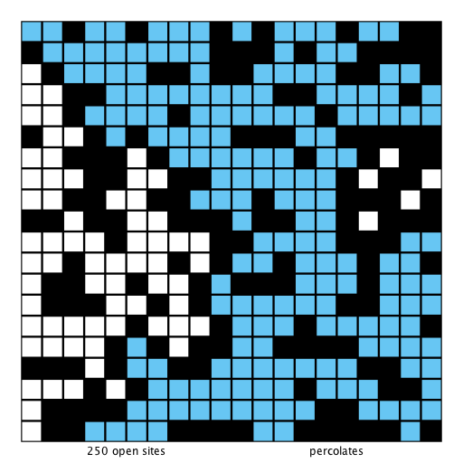

# Percolation-Simulation
This project simulate the process of percolation by a simulation Model.
We model a percolation system using an n-by-n grid of sites. Each site is either open or blocked. A full site is an open site that can be connected to an open site in the top row via a chain of neighboring (left, right, up, down) open sites. We say the system percolates if there is a full site in the bottom row. In other words, a system percolates if we fill all open sites connected to the top row and that process fills some open site on the bottom row. (For the insulating/metallic materials example, the open sites correspond to metallic materials, so that a system that percolates has a metallic path from top to bottom, with full sites conducting. For the porous substance example, the open sites correspond to empty space through which water might flow, so that a system that percolates lets water fill open sites, flowing from top to bottom.)

## Getting Started
Simply comile and run the PercolationVisualizer.java with filename inside the 

### Prerequisites

Perfered to use IntelliJ As the IDE to run this program. Simply open the Readmet folder with intellJ.

If using terminal using the following the command:  
javac  PercolationVisualizer.java  
java PercolationVisualizer jerry47.txt

**Note be aware that if not using itellJ some of the import file is in the .lift/algs4.jar,and if there is a import error try to move them to the same directory as the java File.**  

## Contributing

This is a Assignment base on the course Of algorithm：https://www.coursera.org/learn/algorithms-part1

## Authors

* **Yifei Liang** - Percolation.java, PercolationStats.java.

## Acknowledgments

* Testing code were provided by the course
